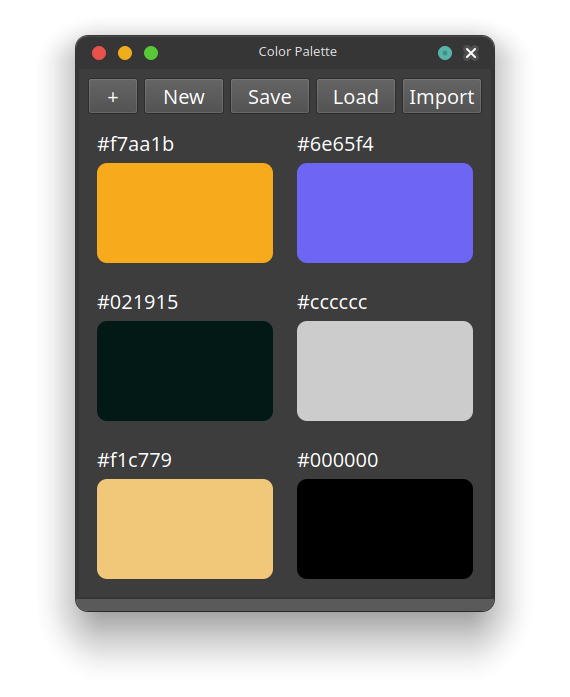

# Color Palette

Welcome to the Color Palette, an essential tool for web developers and designers. This app helps you save time and effortlessly manage your color palette by storing and organizing your colors.

## Introduction

The Color Palette is a Python-based application that simplifies color management. It offers a user-friendly interface for adding, organizing, importing and copying colors. You can also conveniently save and laod different color palettes according to your workflow. You can import colors directly from a css file. 

## Getting Started

To quickly get started with the Color Palette app, you can download the pre-built binaries for your platform:

- [Download the Windows executable (.exe)](https://github.com/ART3MISTICAL/color-palette/releases/download/v0.3.0/color_palette.exe)
- [Download the macOS application (.dmg)](https://github.com/ART3MISTICAL/color-palette/releases/download/v0.3.0/color_palette_macos.dmg)
- [Download the Linux binary (.bin)](https://github.com/ART3MISTICAL/color-palette/releases/download/v0.3.0/color_palette_linux.bin)

Alternatively, if you prefer to run the app from the source code, follow these steps:

1. Clone the repository: `git clone https://github.com/art3mistical/color-palette.git`
2. Install the required Python packages: `pip install -r requirements.txt`
3. Run the app: `python3 main.py`
4. Start organizing your color palette with ease!

## How it Works

1. The app provides an intuitive UI with a color grid.
2. You can add colors to your palette by clicking the "+" button.
3. Colors are organized in a grid layout based on your color count.
4. Right-clicking a color block opens a context menu to copy color values or remove the color.
5. Left click automatically copies the hex color code
6. You can import colors directly from a file

## Example Usage

1. Click the "+" button to add a new color to your palette.
2. Right-click the added color to copy its HEX or RGBA values.
3. Click the "+" button to add more colors or right-click to remove colors.
4. The grid layout adjusts as you add or remove colors.
5. Click the import button to import colors from a css/html/js file

## Contribution Guidelines

Contributions to this project are welcomed! If you have suggestions, feature requests, or bug fixes, please open an issue or submit a pull request.

## License

This project is licensed under the MIT License. You can find the details in the LICENSE file.
